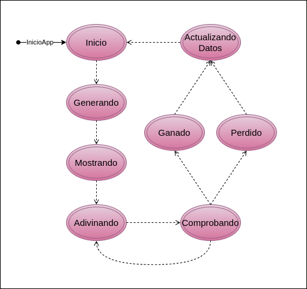

# SimonDice

Este programa implementa un juego clásico de "Simón Dice". La arquitectura sigue principios de separación de responsabilidades (MVVM).

---

## Diagramas

### Diagrama de Secuencia


### Diagrama de Estados



---

## Explicacion de la aplicación

### Base del Programa

Este respositorio continua el programa del respositorio [Proyecto01](https://github.com/LuciaPosada/Proyecto01), donde el programa aun no seguia el modelo MVVVM, debido al cambio a esta arquitectura, decidi crear un nuevo repositorio para continuar el desarrollo de manera mas ordenada.

---

### Datos (Model)

Contiene los datos del programa

<details>
    <summary>Expandir</summary>
<br>

```bash

> enum Colors():

    Colores utilizados por el juego, relevantes para los botones (graficos), la generacion de secuencias y su
    apariencia en pantalla

    Componentes:
        - num: Un número entero único que representa al color
        - nom: Una cadena que indica el nombre del color
        - color: Un objeto Color que representa el color principal
        - color_suave: Otro objeto Color que representa una versión suave del color

    Colores definidos: ROJO, VERDE, AMARILLO, AZUL
 
> enum Estados():

    Estados por los que pasa el juego a lo largo de una ronda, relevantes para manajar las acciones del juego y
    la habilitación de los botones

    Componentes:
        - btnComenzar_activo: Booleano que indica si el botón de inicio está habilitado.
        - btnColor_activo: Booleano que indica si el botón de selección de colores está habilitado.

    Estados definidos:
        - INICIO: El juego está listo para comenzar
        - GENERANDO: El juego está generando una secuencia maquina
        - MOSTRANDO: El juego está mostrando la secuencia maquina
        - ADIVINANDO: Es el turno del jugador
        - COMPROBANDO: El juego esta verificando la respuesta del jugador
        - ACTUALIZANDO_PERDIDO y ACTUALIZANDO_GANADO: Estados finales que actualizan el marcador dependiendo del resultado.
       
> object Datos:

    Coleccion de todos los datos relevantes para la ejecucion del juego que varian a lo largo de este

    Componentes:
        - rondaLiveData: OBSOLETA
        - secuenciaMaquina: Lista mutable que almacena la secuencia generada por el programa
        - secuenciaJugador: Lista mutable que almacena la secuencia ingresada por el jugador
        - rondasConsecutivas: Entero que registra el número de rondas consecutivas exitosas del jugador
        - record: Instancia de una clase interna Record, que registra el número máximo de rondas alcanzadas
        - Record: Contiene un atributo numRondas para almacenar el récord de rondas consecutivas

```

</details>

---
 
### ViewModel

Contiene las funciones del programa + variables para los observers

<details>
    <summary>Expandir</summary>
<br>

```bash

> estadoLiveData:
    Es una instancia de MutableLiveData, que se utiliza para notificar a la UI de los cambios de estado

> iluminadoFlow:
    Es un MutableStateFlow que emite el índice del color actual que debe ser iluminado, o null para apagar la iluminación

> manejarEstados():
    Lanza los metodos especificos para cada estado cuando detecta un cambio de estado actual
 
> mostrarSecuencia():
    Muestra la secuencia generada "iluminando" los botones de forma secuencial

> generarSecuencia():
    Añade a la secuencia de colores un numero del 1 al 4 generado aleatoriamente
 
> añadirColorSecuenciaJugador():
    Añade el identificador de color a la secuencia del jugador
 
> resetearSecuencias():
    Vacia las secuencias de colores creadas por el usuario, ademas de la del el propio programa si se la pasa un true

> compararSecuencias():
    Compara el último elemento de la secuencia del jugador con el correspondiente en la secuencia generada
 
> comprobarRondaTerminada():
    Comprueba que la secuencia del jugador sea del mismo tamaño a la secuencia maquina

> incrementarRonda(): 
    Incrementa el numero de rondas consecutivas superadas

> resetearRonda():
    Devuelve a cero el numero de rondas consecutivas superadas
 
> setNuevoRecord():
    Aumenta el record de darse el caso que se haya superado

> comprobarRecord():
    Comprueba que si se ha superado el recod de rondas consecutivas
 
> comprovarAdivinacion():
    Controla los cambios de estado a realizar segun el imput del usuario durante el estado *ADIVINANDO*
 
> getRonda():
    Devuelve el número actual de rondas consecutivas

> getRecord():
    Devuelve el récord de rondas consecutivas

```

</details>

---

### UI (View)

Contiene las funciones composables para la interfaz

<details>
    <summary>Expandir</summary>
<br>

```bash

> UI()
    Punto de entrada de la UI

> SimonDice()
    Cuerpo principal de la interfaz

    Contiene:
        - Texto con información sobre la ronda y el récord
        - Botones para cada color (rojo, azul, verde y amarillo)
        - Un botón para comenzar la partida
        - Texto para mostrar qué botón ha sido seleccionado por el jugador

> BotonComenzar()
    Logica y diseño del boton comenzar

    Acciones al pulsar:
        - Cambia el estado del juego a *GENERANDO*, comenzando una nueva ronda
 
> BotonColor()
    Logica y diseño de los botones de colores

    Acciones al pulsar:
        - Cambia el estado del juego a *COMPROBANDO* para evaluar el resultado
        - Reporta el color seleccionado al uno de los Text de la interfaz
        - Añade el color del boton pulsado a la secuencia del jugador

```
    
</details>

---

### Mejoras

El programa requiere hacerle un refractor para modularizar mas la interfaz y modificar algunos metodos para que sean mas versatiles.


